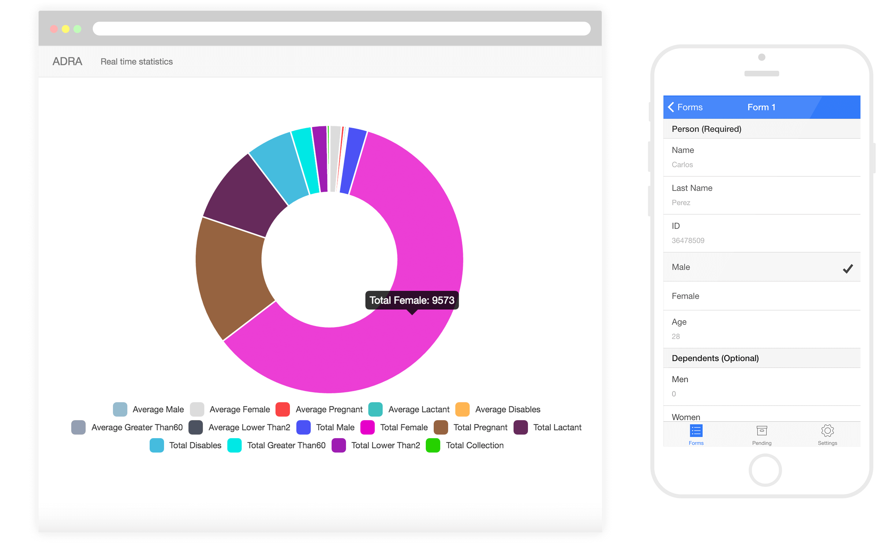

# ADRA App



This app was made for [ADRA Argentina](http://www.adraargentina.org/) to collect real time data about hard hit areas and improve decision-making.

At the time of an emergency, information is a really valuable resource for ADRA. Time, money and human resources were spent by doing manual surveys, shipping these to ADRA office, doing data entry to get all the information in excel and finally analyze it.

The purpose of this app is to eliminate long and manual data processing / interpretation of surveys by taking advantage of computer analysis.

[ADRA](http://www.adraargentina.org/) works within communities in more than 130 countries to bring long-term development programs and immediate emergency relief through an active network of global offices. By partnering with communities, organizations, and governments, ADRA is able to improve the quality of life of millions.

### Prerequisites
* install [adra-api](https://github.com/keepers/adra-api) to store and expose data
* install [adra-web](https://github.com/keepers/adra-web) to display real time information

### Set up
```
$ git clone https://github.com/keepers/adra-app.git
$ cd adra-app
```

### Run
```
$ ionic serve
```
